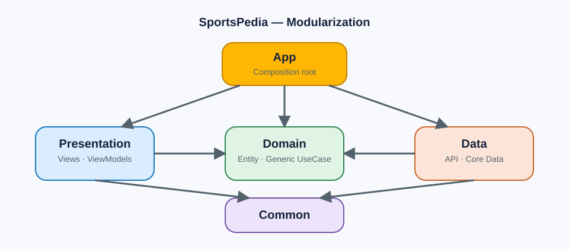

# Modularization SportsPedia

| Modul | Tanggung jawab |
| --- | --- |
| App | Composition root dan dependency injection. |
| Presentation | SwiftUI screen dan ViewModel; hanya bergantung pada Domain dan Common. |
| Domain | Entity serta kontrak `UseCase<Input, Output>` generic dan repository. |
| Data | Implementasi repository, API TheSportsDB, dan penyimpanan favorit Core Data. |
| Common | Utilitas bersama, termasuk `CommonLocalization` dan `HTTPClient`. |

`SportsPediaModules/Package.swift` adalah local Swift Package. Target `SportsPediaData` bergantung pada `SportsPediaCommon` dan `SportsPediaDomain`, lalu diimpor aplikasi utama untuk mengakses client TheSportsDB v2.

## TheSportsDB v2

`SportsPediaData` menggunakan header `X-API-KEY` dan memiliki endpoint type-safe untuk Search, Lookup, List, Filter, All, Schedule, serta Livescores. Aplikasi menggunakan `list/teams/4328` untuk menampilkan tim English Premier League. Isi `API_V2_KEY` secara lokal melalui Build Settings; v2 membutuhkan Premium API key.

## Catatan fitur tambahan

**Sortir daftar tim** memungkinkan pengguna mengurutkan hasil berdasarkan nama tim atau negara melalui menu di navigation bar. Tujuannya mempercepat eksplorasi katalog saat daftar tim panjang, tanpa mengubah hasil pencarian atau data favorit pengguna.

## Quality gate

GitHub Actions pada `.github/workflows/ios-ci.yml` menjalankan SwiftLint, unit test XCTest dengan code coverage, mengunggah artefak hasil test/coverage, dan audit dependency bila lockfile Swift Package tersedia.
